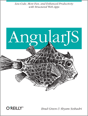

AngularJS-translation
=====================

Chinese translation of book AngularJS

Please include following information if you use my translation in your text:

- Author: Brad Green &amp; Shyam Sesbadri
- Translator：[aztack](http://aztack.github.com/)

Other AngularJS Resources:
- [AngularJS FAQ](http://docs.angularjs.org/misc/faq)
- [AngularJS Developer Guide](http://docs.angularjs.org/guide/overview)
- [AngularJS API Reference](http://docs.angularjs.org/api)
- [AngularJS Batarang - Chome debuggin extension](https://chrome.google.com/webstore/detail/angularjs-batarang/ighdmehidhipcmcojjgiloacoafjmpfk?hl=en)
- [AngularJS CRUD application demo](https://github.com/angular-app/angular-app)
- [ToDo List Demo using AngularJS](http://todomvc.com/architecture-examples/angularjs)
- [Neat things built with AngularJS](http://builtwith.angularjs.org/)

*There are also some Angular learning resources in the project issues section, check it out*

