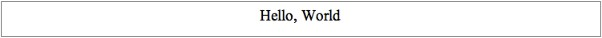
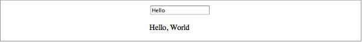
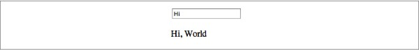
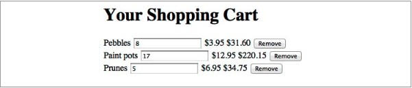

认识AngularJS
=============

我们拥有创造令人拍手叫绝的Web应用的非凡能力，与此同时，创造这些应用的复杂度也是不可思议的。我们Angular团队希望能够减少开发AJAX应用的痛苦。在Google，我们从Gmail，Maps，Canlendar此类项目中吸取经验，借此希望能够让其他人从我们的经历中获益。

我们希望编写Web应用的感觉就像我们第一次被几行代码带来的成就感所震惊那样。我们还希望编码过程更多的是在创造，而不是为了迎合浏览器匪夷所思的内部工作原理而不断地试错。

与此同时，我们希望构建一个开发环境，可以帮助我们决策如何设计我们的产品。可以使产品更容易被创建、被认知。继而让产品在成长过程中仍然易测试，易扩展，易维护。

我们尝试在Angular框架中做到这些，而结果也是令人欣喜的。能达到这样的结果，很大程度上归功于Angular开源社区中的开发者们。他们互相帮助、工作出色，同时也让我们学到很多东西。我们希望你也来加入我们的社区，帮助我们让Angular变得更好。

你可以从我们的GitHub代码库中阅读、拷贝、测试一些更复杂的代码实例和代码片段。

概念
====
在编写Angular应用的过程中你会用到一些核心概念。这些概念并不是我们发明的，而是从其他开发中借鉴，并在HTML，浏览器以及Web标准这个环境中重新实现的。

客户端模板
---------
多页面Web应用通过在服务器端拼装数据来创建HTML，之后将拼装好的HTML发送给浏览器。大多数单页面Web应用(也叫AJAX应用)在某种程度上也是这么做的。Angular则不同，首先模板和数据被发送到浏览器端，然后在那里拼装。服务器端的角色变成了单纯的静态资源和与之对应的模板提供者。

让我们先看一个Angular实例，看看浏览器端用模板拼装数据是怎么一回事儿。我们以经典的“Hello,World”为例。当然，我们不会简单地将“Hello,World”作为单独的字符串。稍微复杂一点，我们将“Hello”视为数据，以便以后更改。

首先，我们创建 _hello.html_模板：

```html
<html ng-app>
<head>
  <script src="angular.js"></script>
  <script src="controllers.js"></script>
</head>
<body>
  <div ng-controller='HelloController'>
    <p>{{greeting.text}}, World</p>
  </div>
</body>
</html>
```

以及代码逻辑 _controller.js_：

```javascript
function HelloController($scope){
	$scope.greeting = {text: 'hello'};
}
```

在任意浏览器中加载_hello.html_，你将会看到#{&* 图1-1}中的结果：


_图 1-1. Hello,World_

Angular与当今流行的一些方案有一些有趣的不同之处：

- HTML标签中没有ID和class用以注册事件监听函数。
- *HelloController*将*greeting.text*设置成*Hello*，而我们并没有注册任何事件监听函数或回调函数。
- *HelloController*是一个一般的JavaScript类(函数)，没有继承任何Angular类。
- *HelloController*不需要创建$scope对象
- 你不需要调用*HelloController*，更不需要琢磨到底何时该调用它

我们会在后面看到更多的不同之处，但是首先要明确一点：Angular应用和以往类似的应用在结构上非常不同。

我们为什么这么设计？Angular如何工作？让我们看一下Angular从别处“偷学”来的好的设计。

模型、视图、控制器（MVC）
-----------------------

早在1970年，MVC应用结构就被引入到Smalltalk中。从Smalltalk被创建伊始，MVC就在几乎所有涉及到界面交互的桌面开发环境中流行起来了。不管你是使用C++，Java还是Objective-C，都会接触到不同风格的MVC。但直至今日，Web（前端）开发仍是MVC未触及的领域。

MVC的核心思想就是：隔离“数据管理#{&= 数据模型Model}、应用逻辑#{&= 控制器Controller}、数据表现#{&= 视图View}”三者的代码。

视图从数据模型获取数据并展现给用户。当用户通过点击或键盘与应用进行交互时，控制器通过改变数据模型中的数据加以反馈。最后，数据模型将这个变化通知给视图，视图再根据更新的数据重新渲染。

我们认为MVC是一个很#{&? neat,简洁}的设计：首先，它事先规定好哪些代码应该放在哪个模型中，你不用再自己琢磨。其他开发人员看到你的MVC代码组织结构，可以快速了解你的代码意图。更重要的是，它将使你的应用更易扩展、易维护，易测试。

数据绑定
--------
在AJAX单页面应用流行之前，Rails，PHP和JSP这类开发平台通过将数据和HTML片段拼凑起来，以辅助创建用户界面#{&= 所谓的意大利面式的开发方式}。jQuery这类框架将这种开发方式扩展到了浏览器端。但与前者不同的是，后者可以更新DOM的一部分，而不是整个页面：将数据填充到模板中，然后将某个DOM元素的innerHTML设置为填充后的字符串。

这种编写方式工作得很好，但是当你想更新UI中的数据，或者想根据用户输入更新数据的时候，你需要做一些工作来同步UI和JavaScript中的数据。

假若我们可以不用写任何代码就可以完成这些工作又会如何？如果我们仅需声明UI数据与JavaScript变量（属性）的对应关系，它们会自动同步又会如何？这就是所谓的“数据绑定”。我们之所以将之引入Angular，是因为它可以大大简化你编写MVC中视图和数据模型的工作。大多数数据同步都会自动完成。

眼见为实，我们还继续使用上面的实例，让它变得更“动态”一点。如上所示，HelloController设置了greeting.text之后就再也没有改变过它。为了让它更“动态”一点，我们增加一个可以接受用户输入的input输入框：

```html
<html ng-app>
<head>
  <script src="angular.js"></script>
  <script src="controllers.js"></script>
</head>
<body>
  <div ng-controller='HelloController'>
    <input ng-model='greeting.text'>
    <p>{{greeting.text}}, World</p>
  </div>
</body>
</html>
```

HelloController的代码没有任何变化。
在浏览器中刷新页面，你会看到#{&* 图1-2}：



_图1-2,Greeting应用的默认状态_

如果我们将输入框中的文字从Hello改为Hi，你将看到图1-3中的变化：



_图1-3,输入变化后的Greeting应用_

没有为输入框注册任何事件监听函数，我们就完成了根据用户输入自动更新UI的功能。同样，如果数据来自服务器，也可以实现这种效果。在控制器中，我们可以向服务器发起一个请求，从响应中获取数据并并存到*$scope.greeting*中。Angular会自动更新输入框和花括弧中的内容。

依赖注入
--------

虽然前面提到过，但是这里还是要赘述一下：*HelloController*中有很多技术细节我们不需要自己实现。比如，用于数据绑定的*$scope*变量，是自动传给*HelloController*的，我们不需要调用任何函数创建它。我们只需将它作为*HelloController*的第一个参数就可以了。

在后面的章节中会提到，除了*$scope*之外，如果你希望数据绑定到浏览器当前URL，你可以在*$scope*后面加上*$location$*参数, ,如下：

```javascript
function HelloController($scope, $location) {
  $scope.greeting = { text: 'Hello' };
  // 使用 $location ...
}
```

这些都是通过Angular的“依赖注入”系统实现的。它使我们可以不用创建依赖关系，只需“饭来张口”就好了。

这种设计遵循了“迪米特法则”#{&= Law of Demeter}，亦即最少知识原则。既然我们的*HelloController*的职责是初始化Greeting模型，根据LoD法则，*HelloController*不应该关心其他任何事情：比如如何创建*$scope*，从哪儿可以找到它。

这个原则不仅用在Angular框架中。你可以将之应用到你的其他代码中。

#{&:= Directive,指令}
----

Angular最棒的特性之一就是，你可以像写HTML一样写模板。之所以可以这么做，是因为，在Angular框架中包含一个强大DOM转换引擎，通过它你可以扩展HTML语法。

我们已经在上面的模板中见识过非HTML标准的新属性。包括用来绑定数据的双花括弧；用来指定哪个控制器监控哪部分视图的ng-controller属性；用来将输入框和数据模型绑定起来的ng-model属性。这些都被称为HTML扩展#{Directive}。

Angular内置了很多#{Directive}来帮助开发者定义视图，后面我们将会看到。这些#{Directive}可以用来定义我们通常所说的模板。也会用来声明你的应用如何工作，亦或是用来定义可复用的组件。

Angular的#{Directive}并不局限在内置的#{Directive}集，你还可以定义自己的#{Directive}。

实例:购物车
----------

让我们再看一个相对复杂的实例以展示Angular更多特性。想象我们将创建一个购物应用。在应用中，我们需要向用户提供一个展示、编辑购物车中物品的页面。让我们直接跳到这个部分：

```html
<html ng-app>
<head>
  <title>Your Shopping Cart</title>
</head>
<body ng-controller='CartController'>
  <h1>Your Order</h1>
  <div ng-repeat='item in items'>
    <span>{{item.title}}</span>
    <input ng-model='item.quantity'>
    <span>{{item.price | currency}}</span>
    <span>{{item.price * item.quantity | currency}}</span>
    <button ng-click="remove($index)">Remove</button>
  </div>
  <script src="https://ajax.googleapis.com/ajax/libs/angularjs/1.0.1/angular.min.js"></script>
  <script>
    function CartController($scope) {
      $scope.items = [
        {title: 'Paint pots', quantity: 8, price: 3.95},
        {title: 'Polka dots', quantity: 17, price: 12.95},
        {title: 'Pebbles', quantity: 5, price: 6.95}
      ];
      $scope.remove = function(index) {
        $scope.items.splice(index, 1);
      }
    }
  </script>
  </body>
</html>
```

运行结果如下#{&* 图1-4}所示



下面是对代码的简要说明。本书其他部分将会对各知识点做更深入的讲解。

我们先看一下第一行代码：

```html
<html ng-app>
```

*ng-app*属性指明页面中的哪个部分应该由Angular来管理。如代码所示，我们将这个属性置于#{&< html}上，说明我们希望Angular管理整个页面。一般情况都是如此，个别情况你可能希望Angular只管理某个#{&< div}。尤其当你希望将你的代码放到已有的Angular应用中。

```html
  <body ng-controller='CartController'>
```

在Angular中你通过叫做控制器的JavaScript类来管理页面上的各个区域。上面代码中，通过在#{&< body}上增加一个*ng-controller*的标签，我们声明*CartController*将管理#{&< body}和#{&> body}之间的部分。上

```html
<div ng-repeat='item in items'>
```
*ng-repeat*将导致#{&< div}里的DOM结构为items数组中的每一个元素拷贝一份。对于每份拷贝，都对应一个可以在模板中使用的item变量。这部分代码的结果就是产生了三分包含产品名称、产品数量、单价、总价和删除按钮的DOM结构。

```html
<span>{{item.title}}</span>
```

如在“Hello,World”例子中展示的一样，数据绑定通过{{}}让我们可以将变量值插入到页面中，并#{&~ 自动}的保持同步。{{item.title}}将当前迭代中item.title插入到DOM中。

```html
<input ng-model='item.quantity'>
```

*ng-model*将创建一个输入框和item.quantity之间的#{&~ 双向}数据绑定。#{&< span}之间的{{}}则是单向的，仅仅是“将变量值放在这里”而已。这是我们需要的结果，但是当用户改变商品数量的时候，我们应用需要知道，这样才能计算商品的总价。

我们将使用*ng-model*来同步#{&~用户做出的}改变。*ng-model*声明将*item.quantity*插入到文本框中，同时自动将用户输入同步到*item.quantity*。

```html
<span>{{item.price | currency}}</span>
<span>{{item.price * item.quantity | currency}}</span>
```

我们希望物品单价和总价以美元表示。Angular有一个叫做“#{&= Filters,过滤器}”的特性，可以帮助我们格式化文本。其中有一个内置#{Filters}叫*currency*，它可以帮助我们给价格加上美元符号。我们会在后面的章节深入讨论#{Filters}。

```html
<button ng-click="remove($index)">Remove</button>
```

通过点击删除按钮,允许用户删除购物车中的物品。通过设置，点击删除按钮会调用remove函数，再将当前物品对应的索引值$index传给remove，完成删除。

```javascript
function CartController($scope)
```

*CartController*负责购物车的#{&~ 各种}逻辑。我们将*$scope*传给控制器，这样就可以使用它完成数据和UI元素之间的绑定。

```javascirpt
$scope.items = [
  {title:'Paint pots',quantity:8, price: 3.95},
  {title:'Polka dots',quantity:17, price: 12.95},
  {title:'Pebbles',quantity:5, price: 6.95},
];
```

通过定义*$scope.item*，我们定义了一组虚构的购物车数据。

当然，真实世界里这是不可能的，我们需要向服务器请求真实数据。具体如何做，会在后面章节讲到。

```javascript
$scope.remove = function(index){
  $scope.items.splice(index,1);
}
```

我们希望在模板中使用remove函数，那么我们将它增加到*$scope*中。对于虚构的数据，remove函数仅仅是将对应的数据从数组中删除。因为物品列表使用*ng-repeat*创建，是数据绑定的。所以当物品中的元素被删除的时候，页面中的列表会自动更新。

接下来...
---------
在本章你所见到的都是Angular最基本的概念和实例。本书其余部分将会详尽介绍Angular的方方面面。