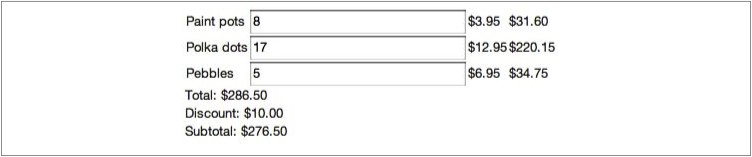

使用其他库的时候，你从#{&~ 众多}函数中挑选需要的使用。但Angular不是，它被设计成一个#{&:= collaborative suit,协作套件}。本章将讲述Angular的基本组成，好让你理解它们是如何组合到一起的。在后面的章节，还会详细讲述这些基本组成。

调用Angular
===========

为了启动Angular，你的应用需要做两件事情：

1.加载 angular.js
2.通过ng-app告诉Angular管理哪部分DOM

加载脚本
--------

加载Angular和加载其他JavaScript库一样。你可以从Google的CDN加载：

```html
 <script src="https://ajax.googleapis.com/ajax/libs/angularjs/1.0.4/angular.min.js"></script>
```

推荐你是用Google的CDN。#{&~ 国内推荐使用国内的CDN或者下载下来放到你的服务器上。}Google的服务器速度快，脚本可以缓存，供不同的应用使用：如果你的用户使用了多个Angular开发的应用，她只需要下载一次。如果用户已经访问过使用了Google CDN上的angular.js的网站，她就不需要再为你的网站下载一份了。

如果愿意，你也可以将代码放在你的服务器（或其他服务器）。设置正确的src就可以了。

用ng-app声明Angular的作用范围
----------------------------

通过*ng-app*，你可以设置Angular的作用范围。如果你想创建一个全部使用Angular的应用，你应该将ng-app放在#{&< html}标签上，比如：

```html
<html ng-app>
...
</html>
```

这样，Angular将管理整个页面的DOM元素。

你还可以通过在如#{&< div}的元素上增加ng-app来向已有的Java、Rails等应用中引入Angular。

```html
<html>
	...
	<div ng-app>
		...
	</div>
</html>
```

模型/视图/控制器
================

在第一章我们提到过，Angular支持基于MVC的设计。虽然你可以灵活的设计你的Angular应用，但对于下面三个方面，你总会遵循某个风格：

- 描述应用状态的数据模型
- 展示数据的视图
- 协调模型和视图的控制器

通过创建对象属性，甚至是基本数据类型的数据就可以创建模型。模型变量#{&~ model variable}没有什么特别之处。如果你想呈现一段文字给用户，你定义一个字符串就可以了：

```javascipt
var someText = 'You have started your journey.';
```

通过创建模板，并将模型中的数据插入其中就可以创建视图。你已经在前面章节见过，你可以在DOM中放一个占位符：

```html
 <p>{{someText}}</p>
```
这称之为#{double-curly}插值语法，它会在模板中插入新的内容。

控制器是JavaScript类#{&~ 函数}或者#{&? 某种类型}。通过设置传入的*$scope*变量的属性，告诉Angular你的数据模型由哪些对象或基本类型构成:

```javascript
function TextController($scope){
	$scope.someText = someText;
}
```

将上面的代码片段整合起来：

```html
<html ng-app>
	<body ng-controller="TextController">
		<p>{{someText}}</p>
		<script src="https://ajax.googleapis.com/ajax/libs/angularjs/1.0.1/angular.min.js"></script>
		<script>
			function TextController($scope){
				$scope.someText = 'You have started your journey.';
			}
		</script>
	</body>
</html>
```

在浏览器中打开上面页面，你将看到

> You have started your journey.

上面这种基本模型在简单情况下工作得很好。对于大多数应用，你还是希望创建模型对象来容纳你的数据。我们下面创建一个消息模型#{&~ message model}来保存someText。所以，将

```javascript
	var someText = 'You have started your journey.';
```

替换为

```javascript
var messages = {};
messages.someText = 'You have started your journey.';
function TextController($scope){
	$scope.messages = messages;
}
```

模板修改为

```html
 <p>{{messages.someText}}</p>
```

在后面我们会讨论这个*$scope*对象。像这样创建模型可以避免由*$scope*的#{&? 原型链}带来的不可预知的行为。

在全局定义*TextController*并不是一个最佳实践。将之定义为某个模块的一部分可以避免不必要的麻烦。模块为你的应用相关部分提供一个名字空间。下面改用名字空间重写上面代码：

```html
<html ng-app="myApp">
	<body ng-controller="TextController">
		<p>{{someText.message}}
		<script src="https://ajax.googleapis.com/ajax/libs/angularjs/1.0.1/angular.min.js"></script>
		<script>
			var myAppModule = angular.module('myApp',[]);
			myAppModule.controller('TextController',function($scope){
				var someText = {};
				someText.message = 'You have started your journey.';
				$scope.someText = someText;
			})
		</script>
	</body>
</html>
```

在这个版本中，我们设置了*ng-app*对应的模块为*myApp*。然后用*angular.module*定义了*myApp*模块，最后用将控制器对应的函数传给模块的*controller*函数，定义了*TextController*。

我们在后面会想些解释为什么这么写。现在，你只需记住通过使用模块避免创建全局对象是一个最佳实践。

模板和数据绑定
=============

Angular中的模板和从服务器获取的，#{&< script}标签中定义的静态资源一样，只是普通的HTML文档。你可以使用标准HTML和Angular#{Directive}创建UI组件。

一旦被浏览器解析，Angular将数据填充到模板中并展开，形成最终的应用。我们在第一章显示购物列表的时候见识过：

```html
 <div ng-repeat="item in items">
	<span>{{item.title}}</span>
	...
 </div>
```

上面代码中，*items*数组中的每个元素都会对应复制一份#{&< div}及其子元素的拷贝。

这些数据是从哪儿来的？在购物车实例中，我们在代码中定义了这些数据。#{&~ 在数据中定义数据}在测试UI的时候很方便使用。但是对于大多数应用来说都会从远端服务器请求持久化的数据。在浏览器中，你的应用连接服务器，请求需要的数据，填充模板，呈现结果给用户。

基本流程如下：

1.用户请求你的应用首页
2.用户浏览器建立HTTP连接，加载包含模板的index.html页
3.Angular被加载，等待页面完全加载后，寻找ng-app来确定作用范围
4.Angular遍历模板，查找各种#{Directive}和绑定。最终，DOM节点被创建、修改，事件监听器被注册，初始数据被请求，模板被转化为DOM树。
5.你在适当的时候，连接服务器加载其他数据并显示给用户

对于每个Angular应用来说，第一步到第三部是一样的。第四步和第五步根据你的需求，需要自定义。这些步骤可能是同步或者异步发生的。为了提高性能，避免多余请求，首屏数据可以和模板一并获取。

通过使用Angular组织你的应用，模板和对应的数据被分离开。这样模板可以被缓存，新的数据从服务端加载。和JavaScript文件，图片，CSS，其他资源一样，缓存模板可以提升应用的性能。

显示文字
-------

通过使用*ng-bind*#{Directive}，你可以在UI的任何地方显示更新文本。有两种等价的写法，一种我们已经见过，即#{&:= double-curly}语法:

```html
 <p>{{greeting}}
```

另外一种写法是基于#{Directive}的：

```html
 <p ng-bind="greeting"></p>
```

两种写法输出结果是一样的。如果模型变量#{&~ model variable} 'greeting'被设置为 "Hi there",Angular将会生成如下HTML片段：

```html
 <p>Hi there</p>
```

浏览器会显示 "Hi there"。

话说回来了，为什么要有两种写法呢？是这样的，#{double-curly}语法开起来更自然易读，代码量更少。虽然两种写法都产生同样的HTML，#{double-curly}的写法在首屏显示的时候，在数据没有填充前，可能会被用户看到。后续的视图不会有这个问题。

会被用户看到未填充的模板是因为，只有当浏览器完全下载页面之后，Angular才有机会解析模板。好消息是，在大多数情况下，你都可以使用#{double-curly}语法来书写模板。在首页，你可以使用*ng-bind*的写法避免模板被看到的问题。


表单输入
--------

Angular中使用表单元素很简单。像之前实例所示，你可以用*ng-model*将元素和数据模型的属性绑定起来。这种方法适用于所有标准的表单元素，比如输入框#{&~ inputs}，单按按钮#{&~ radio buttons}，勾选框#{&~ checkboxs}等等。我们可以这样绑定一个checkbox和某个属性：

```html
 <form ng-controller="SomeController">
 	<input type="checkbox" ng-model="youCheckedIt">
 </form>
```

解释：
1.当用户选择/取消勾选框的时候，*$scope*的youCheckedIt属性将会被设置为true/false。
2.如果你在SomeController中将*$scope.youCheckedIt*设置为true/false，那么勾选框将被选中/未选中。

现在，我们希望用户做出某个行为时做点事情。为输入框增加*ng-change*#{Directive}并指定控制器的一个方法，当输入框的内容发生变化的时候，这个方法会被调用。下面我们实现一个简单的计算器，帮助#{&.. what's startup owners?}

```html
 <form ng-controller="StartUpController">
 	Starting: <input ng-change="computeNeeded()" ng-model="funding.startingEstimate">
 	Recommendation: {{funding.needed}}
 </form>
```

为了简化问题，我们直接将输出设为用户估值的十倍，并把初始估值设置为0：

```javascript
function StartUpController($scope){
	$scope.funding = {startingEstimate: 0};
	$scope.computeNeeded = function(){
		$scope.needed = $scope.startingEstimate * 10;
	};
}
```

这段代码里有一个潜在的问题：当用户输入时，我们只重算了需要的数量。如果输入框仅在用户输入时得到更新，那么不会有问题。但如果其他输入框也绑定了这个属性会怎么样？如果输入框是因为服务器有新数据过来而更新的又会如何？

为了避免上面的问题，我们可以使用*$scope.$watch*函数来监控一个表达式，每当表示发生变化都会调用你提供的回调函数。这是最基本的用法，后面我们还会详细介绍*$watch*。

在这个例子中，我们希望监控*funding.startingEstimate*,在它发生变化的时候调用*computeNeeded*。重写上面代码:

```javascript
function StartUpController($scope){
	$scope.funding = {startingEstimate: 0};
	var computeNeeded = function(){
		$scope.funding.needed = $scope.funding.startingEstimate * 10;
	};

	$scope.$watch('funding.startingEstimate',computeNeeded);
}
```

注意，监控的表达式是一个字符串。这个字符串叫做Angular表达式。 表达式里可以做简单的运算，可以访问*$scope*的属性。我们会在后面详细介绍Angular表达式。

你也可以监控函数的返回值，但是监控*funding.startingEstimate*本身#{&~ 不是字符串哦}是不起作用的，因为他初始值是零，并且不再变化。

接下来，因为每当*funding.startEstimate*发生变化的时候，*funding.needed*都会发生变化，我们可以简化上面的模板：

```html
 <form ng-controller="StartUpController">
 	Starting: <input ng-model="funding.startingEstimate">
 	Recommendation: {{funding.needed}}
 </form>
```

在有些情况下，你希望当用户明确通知你她准备好了，然后再做处理，而不是每次发生变化都做处理。比如下单或者发送一段#{&~ 写好的}聊天消息。

如果你有一个form，里面有一组input。你可以给form设置一个*ng-submit*#{Directive}来指定form提交时需要调用的函数。我们扩展一下之前的实例，让用户可以通过点击一个按钮来#{&? 请求启动资金}：

```html
 <form ng-submit="requestFunding()" ng-controller="StartUpController">
 	Starting: <input ng-change="computeNeeded()" ng-model="startingEstimate">
 	<button>Fund my startup!</button>
 </form>
```
```javascript
function StartUpController($scope){
	$scope.computeNeeded = function(){
		$scope.needed = $scope.startingEstimate * 10;
	};

	$scope.requestFunding = function(){
		alert("Sorry, please get more customers first.");
	};
}
```

*ng-submit*#{Directive}会在提交表单时，自动阻止浏览器默认的POST动作。

为了处理其他用户交互，Angular还提供了其他事件处理的#{Directive}，比如，与*onclick*对应的是*ng-click*，与*ondblclick*对应的是*ng-dblclick*,等等。

通过扩展上面的实例我们来试一试：增加一个重置按钮，将输入设置为零。

```html
 <form ng-submit="requestFunding()" ng-controller="StartUpController">
 	Starting: <input ng-change="computeNeeded()" ng-model="startingEstimate">
 	Recommendation: {{needed}}
 	<button>Fund my startup!</button>
 	<button ng-click="reset()">Reset</button>
 </form>
```
```javascript
function StartUpController($scope){
	$scope.computeNeeded = function(){
		$scope.needed = $scope.startingEstimate * 10;
	};
	$scope.requestFunding = function(){
		alert("Sorry, please get more customers first.")
	};
	$scope.reset = function(){
		$scope.startingEstimate = 0;
	};
}
```

关于#{&:= unob-js,不乱入的JavaScript}的一些建议
--------------------------------------

在你的JavaScript开发生涯中，有人会跟你说，你应该写#{&:= unob-js}。在HTML中写诸如*click*,*mousedown*这样的内联事件响应函数不是很么好主意。恩，他是对的。

对于#{unob-js}许多不同的理解。但是这种编程风格基本原理是遵循下面几点的：

1.不是所有的浏览器都支持JavaScript。让所有人都可以在不执行JavaScript的情况下都可以看到网站的所有内容。
2.不同的人群使用的浏览器是不同的。视力有缺陷的人使用屏幕朗读工具；有些手机用户的浏览器不能执行JavaScript。
3.JavaScript在不同的平台#{&~ 浏览器}中有不同的行为。譬如Internet Explorer。你需要针对不同的浏览器做不同的处理。
4.这些#{&~ 内联的}事件响应函数是暴露在全局作用域的。当你这些函数与后续集成进来的代码有名字冲突的时候，就是你痛疼的时候。
5.这些#{&~ 内联的}事件响应函数将结构和行为偶合在一起。这将使你的代码难于维护、扩展和理解。

在大多数情况下，如果你按照这种编程风格编码，你的日子会好过很多。但是，代码的复杂度和可读性并没有变得更好。你不再将事件响应函数附在对应的元素上，而是为元素设置ID，然后获取元素的引用，为之添加事件处理函数。你可以设计一个结构，然后在#{&~ 大家熟知的地方}进行事件绑定。但大多数应用最后还是“满地都是”事件处理函数。

在Angular中，我们决定重新审视这个问题。

这个世界与#{unobj-js}这个概念被创建时的世界已大不相同。上面的第一点对于这个领域相关的人群已经不再使用。如果你的网站还不得不支持一个不能运行JavaScript的浏览器，那么它就被降级到二十世纪的网站了。对于第二点，屏幕朗读工具已经迎头赶上。通过合理使用ARIA #{&~ Accessible Rich Internet Applications}语义化标签，你可以构建非常丰富易用的用户界面。现在，手机已经可以像桌面设备一样运行JavaScript了。

所以，现在的问题是：我们可以解决第三和第四个问题的同时，重新获得代码内联的可读性和简单性么？

就像之前提到过的一样，对于大多数的内联事件响应函数，Angular都有替代方案。比如*ng-eventhandler="expression"*，其中*eventhandler*可以被替换为*click*，*mousedown*，*change*，等等。如果你想在用户点击一个元素的时候做出响应，你只需简单地设置*ng-click*，比如：

```html
 <div ng-click="doSomething()">...</div>
```

你是否隐约听见“别这么做！这样不好！”的声音？好消息是，你可以放心。这处的#{Directive}和之前的内联事件处理函数有所不同：

- 它在不同的浏览器有相同的行为。Angular帮你处理浏览器差异。
- 它不是作用在全局作用于。表达式只能访问指定元素控制器的函数和数据。

第二点听起来有点不好理解，还是让我们用实例来说明吧。在一个典型的应用中，你创建一个导航条和内容区域。当你选择导航菜单中的不同选项时，显示不同的内容。代码框架如下：

```html
<div class="navbar" ng-controller="NavController">
 	...
 	<li class="menu-item" ng-click="doSomething()">Something<li>
 	...
</div>

<div class="contentArea" ng-controller="ContentAreaController">
	...
	<div ng-click="doSomething()">...</div>
	...
</div>
```

上面，导航条的#{&< li}和内容区域的#{&< div}都在用户点击的时候调用了一个叫*doSomething*的函数。作为开发人员，你在控制器中设置这两个函数对应的实现代码。它们可以是同一个函数，也可以是不同的函数：

```javascript
function NavController($scope){
	$scope.doSomething = doA;
}

function ContentAreaController($scope){
	$scope.doSomething = doB;
}
```

上面的*doA()*和*doB()*可以使同一个函数，也可以是不同的函数。

现在就剩下第五点了：耦合了结构和行为。这个说法有些空洞。因为你并不能说出这样做有什么坏处。但是我们还知道一个类似的真实问题：将表现和应用逻辑耦合在一起。#{&? 这当然是有问题的。其实就是人们所说的“结构/行为”}。

我们可以通过一个简单的测试来验证我们的系统#{&~ Angular}是否有#{&~ 结构/行为}耦合问题：我们是否可以为我们的应用逻辑代码写单元测试，而不需要任何DOM结构？

在Angular中，我们完全可以在控制器中编写应用逻辑而不引用任何DOM。其实问题不在事件处理函数，而在我们之前编写JavaScript的方式。请注意，在之前以及这本书的其他地方缩写的控制器代码中，我们从没引用过任何DOM或DOM事件。你可以完全抛开DOM创建控制器。所有定位元素，注册事件响应函数的工作都由Angular来完成。

首先，这对写单元测试很重要。如果你需要DOM，你就不得不在测试前创建DOM，这会增加你的测试的复杂程度。当你的页面发生变化的时候，你还不得不更新DOM。其次，DOM访问很慢。测试变慢意味着反馈变慢，意味着产品发布变慢。测试Angular的控制器完全没有这个问题。

你看，你可以开心的使用声明式的事件处理函数，且不失简单性和可读性。同时也不必为违反最佳实践而内疚。

列表，表格和其他#{&? 重复性}元素
-------------------------------

*ng-repeat*可能是最有用的#{Directive}了。它根据集合中的每个元素创建对应的一组元素拷贝。在需要创建类似列表的地方，你都可以使用它。

假设，我们要给老师写一个学生花名册的应用。我们会从服务器端获取学生数据。对于这个实例，我们将数据定义成JavaScript数组。

```javascript
var students = [
	{name:'Mary Contrary', id: '1'},
	{name:'Jack Sprat', id: '2'},
	{name:'Jill Hill', id: '3'}
];

function StudentListController($scope){
	$scope.students = students;
}
```

为了显示学生列表，我们可以写如下模板：

```html
<ul ng-controller="StudentListController">
	<li ng-repeate='student in students'>
		<a href='/student/view/{{student.id}}'>{{student.name}}</a>
	</li>
</ul>
```

结果是：

- Mary Contrary
- Jack Sprat
- Jill Hill

分别链接到 */student/view/1*, */student/view/2*和*/student/view/3*。

如我们之前看到的，改变stduents数组将自动更新列表。如果我们增加一个学生：

```javascript
var students = [
	{name:'Mary Contrary', id: '1'},
	{name:'Jack Sprat', id: '2'},
	{name:'Jill Hill', id: '3'}
];

function StudentListController($scope){
	$scope.students = students;
		$scope.insertTom = function(){
		$scope.students.splice(1,0,{name:'Tom Thumb', id:'4'});
	};
}
```

再增加一个按钮:

```html
<ul ng-controller="StudentListController">
	<li ng-repeate='student in students'>
		<a href='/student/view/{{student.id}}'>{{student.name}}</a>
	</li>
</ul>
<button ng-click="insertTom()">Insert</button>
```

点击按钮后，你将看到：

- Mary Contrary
- Tom Thumb
- Jack Sprat
- Jill Hill

在*ng-repeate*中，通过*$index*你可以引用到当前元素。通过*$first*,*$middle*,*$last*你可以知道在迭代中是否是第一个元素，中间的元素，亦或是最后一个元素。

你可以用*$index*来作为表格的行号。比如：

```html
<table ng-controller='AlbumController'>
	<tr ng-repeate='track in album'>
		<td>{{$index+1}}</td>
		<td>{{track.name}}</td>
		<td>{{track.duration}}</td>
	</tr>
</table>
```

在控制器中：

```javascript
var album = [
	{name: 'Southwest Serenade', duration: '2:34'},
	{name: 'Northern Light Waltz', duration: '3:21'},
	{name: 'Eastern Tango', duration: '17:45'},
];
function AlbumController($scope){
	$scope.album = album;
}
```

结果是：

```
1 Southwest Serenade 2:34'
2 Northern Light Waltz 3:21'
3 Eastern Tango 17:45'
```

显示和隐藏
----------

对于如菜单、上下文敏感的工具等情况，显示和隐藏元素是一个关键特性。在Angular中，我们以模型的变化驱动UI变化，通过设置#{Directive}，让UI来反映这个变化。这里，我们用*ng-show*,*ng-hide*来显示或隐藏元素。它们根据你传入的表达式，显示或隐藏元素：当表达式为真时，*ng-show*显示元素，为假时隐藏元素。*ng-hide*则相反。你应该根据你的实际情况适时选择是用*ng-show*还是*ng-hide*。
这两个#{Directive}通过设置将元素的display:block将元素显示出来；设置成display:none将元素隐藏。我们虚构一个“死亡射线”控制板的例子来说明如何使用它们：

```html
<div ng-controller='DeathrayMenuController'>
  <button ng-click='toggleMenu()'>Toggle Menu</button>
  <ul ng-show='menuState.show'>
    <li ng-click='stun()'>Stun</li>
    <li ng-click='disintegrate()'>Disintegrate</li>
    <li ng-click='erase()'>Erase from history</li>
  </ul>
<div/>
function DeathrayMenuController($scope) {
  $scope.menuState.show = false;
  $scope.toggleMenu = function() {
    $scope.menuState.show = !$scope.menuState.show;
  };
  // death ray functions left as exercise to reader
}
```

CSS类和样式
-----------

你可能已经意识到，通过#{double-curly}语法的数据绑定，你可以动态的设置CSS类和样式。你甚至可以在模板中拼装部分类名。比如，如果你想根据情况使禁用菜单，你可以这么做：

```css
	.menu-disabled-true{
		color: gray;
	}
```

你可以通过下面模板禁用菜单中的*stun*项：

```html
<div ng-controller='DeathrayMenuController'>
 <ul>
 	<li class="menu-disabled-{{isDisabled}}" ng-click="stun()">Stun</li>
 	...
 </ul>
</div>
```

控制器中，将*isDisabled*设置为适当的值：

```javascript
function DeathrayMenuController($scope){
	$scope.isDisabled = false;
	$scope.stun = function(){
		//stun the target, then	disable menu to allow regeneration
		$scope.isDisabled = 'true';
	};
}
```

*stun*菜单项的样式会被设为*menu-disabled-*加上*$scope.isDisabled*的值。初始状态下类名为是*menu-disabled-false*。但是我们没有定义这个样式，所以没有任何变化。当*$scope.isDiabled*被设为true时，类名为*menu-disabled-true*，此时，菜单文字变为灰色。

这种#{&~ 通过插值的}动态设置样式的方法同样可以用于内联样式。比如： *style="{{some expression}}"*。

这种利用一个间接层#{&~ http://en.wikipedia.org/wiki/Indirection} 来设置样式的方法有些取巧，也有一些缺点。在简单的例子中，你可以理解，但是#{&~ 随这代码规模的增加}它会很快变得无法管理，你不得不时不时的看一下你的模板，再看一下你的代码才能写出正确的CSS。

为了避免这种情况的发生，Angular提供了*ng-class*和*ng-style*两个#{Directive}。二者的第一个参数都是一个表达式。表达式的计算结果可能是以下几个：

- 空格分隔的类名
- 类名数组
- 类名到布尔值的映射

假设，你想在应用头部的一个标准位置展现错误或警告信息。你可以用*ng-class*来实现：

```html
.error {
	background-color: red;
}
.warning {
	background-color: yellow;
}

<div ng-controller='HeaderController'>
	...
	<div ng-class='{error: isError, warning: isWarning}'>{{messsageText}}</div>
	...
	<button ng-click='showError()'>Simulate Error</button>
	<button ng-click='showWarning()'>Simulate Warning</button>
</div>

function() HeaderController($scope){
	$scope.isError = false;
	$scope.isWarning = false;

	$scope.showError = function(){
		$scope.messageText = 'This is an error!';
		$scope.isError = true;
		$scope.isWarning = false;
	};

	$scope.showWarning = function(){
		$scope.messageText = 'Just a warning. Please carry on.';
		$scope.isWarning = true;
		$scope.isError = false;
	};
}
```

你甚至可以通过这个技术做一些技巧性的效果，比如高亮表格中已选择的行。我们来实现一个餐馆名单，当用户点击某行时高亮它。在CSS中定义高亮时的样式：

```css
.selected{
	background-color: lightgreen;
}
```

在模板中，我们先将*ng-class*设置为*{selected: $index==selectedRow}*。当模型中*selectedRow*等于*ng-repeat*的*$index*的时候，就会将样式类名设置为*selected*。然后再增加一个*ng-click*来通知控制器哪行被点击了。

```html
<table ng-controller="RestaurantTableController">
	<tr ng-repeat='restaurant in directory' ng-click='selectRestaurant($index)' ng-class='selected: $index==selectedRow'>
		<td>{{restaurant.name}}</td>
		<td>{{restaurant.cuisine}</td>
	</tr>
</table>
```

在JavaScript中我们设置一些餐馆的测试数据，然后定义*selectRow*函数：

```javascript
function RestaurantTableController($scope){
	$scope.directory = [
		{name:'The Handsome Heifer',cuisine:'BBQ'},
		{name:'Green's Green Greens,cuisine:'Salads'},
		{name:'House of Fin Fish',cuisine:'Seafood'},
	];
	$scope.selectRestaurant = function(row){
		$scope.selectedRow = row;	
	};
}
```
关于src和href的注意事项
----------------------

在为#{&< img}和#{&< a}标签做数据绑定的时候，之前的{{}}插值在它们的src和href属性中是不起作用的。因为与其他资源相比，浏览器会尽可能的并行加载图片。所以Angular没有机会做数据绑定。

```html

```

应该写为

```html

```

类似的

```html
<a ng-href="/shop/category={{numberOfBalloons}}">some text</a>
```

表达式
------

Angular中的表达式的作用是让你可以巧妙地在模板、应用逻辑和数据之间建立联系，而又不会让应用逻辑揉到模板中。

目前为止，我们用的最多的是在传给Angular #{Directive}的表达式中使用基本数据的引用。但是表达式的用法不仅如此。你可以在表达式中做简单的数学运算（+，-，/，*，%）；做比较（==，!=，>，<，>=）；做布尔运算（&&，||，!）以及位运算（^，&，|）。还可以调用$scope的函数，使用数组和对象（[],{}）。

下面这些写法都是正确的：

```html
<div ng-controller='SomeController'>
	<div>{{recompute() /10}}</div>
	<ul ng-repeat='thing in things'>
		<li ng-class='{highlight: $index % 4 >= threshold($index)'>
			{{otherFunction($index)}}
		</li>
	</ul>
</div>
```

*recompute() / 10*是个在模板中写引用逻辑的例子，你应该避免这么做。将试图和控制器分离将使代码更易理解和测试。

你可以在表达式中做很多事情。表达式不是用JavaScript的*eval()*函数解析的，而是由Angular的解析器解析的，所以更具约束力。在表达式中无法使用for,while这类的循环结构，和if-else,throw这类的判断结构，以及++,--这种自增自减操作符。如果你需要这些，你应该在你的控制器中使用。虽然表达式比JavaScript更具约束性，但它更能容忍*undefined*和null的出现。如果遇到这类值，模板会默默的什么都不输出，而不是抛出*NullPointerException*。这允许你在模板中使用未定义或赋值的变量。当这些变量被定义和赋值之后，就会自动出现在模板生成的UI中。

分离UI和控制器的责任
------------------

控制器在应用中有三个责任：

- 初始化数据模型(model)
- 通过*$scope*将模型和函数暴露给视图
- 监控模型的变化并作出反应

我们已经在之前的例子中见过前两个。在后面我们会见到第三个。控制器的意义在于当用户与视图交互的时候，提供可执行的代码（或逻辑）来完成用户的请求。

为了将控制器维持在较小的、可管理的规模，我们建议最好为视图中的每一个功能区域创建对应的控制器。比如，如果你有一个菜单，那就创建一个*MenuController*。如果你有一个“面包屑导航栏”#{&~ http://en.wikipedia.org/wiki/Breadcrumb_(navigation)}，那就创建一个*BreadcrumbController*以此类推。

相信你已经逐渐搞清楚了：控制器与它管理的DOM结构是紧紧关联的。有两种方法将二者关联起来：一，再DOM对应的模板中使用*ng-controller*来声明起对应的控制器名。二，通过*route*将动态加载的DOM模板（*view*）和对应的控制器关联起来。

在本章的后面我们将讨论*view*和*routes*。

如果你的UI比较复杂，你可以通过嵌套控制器来保持代码的简单、可维护。嵌套的控制器通过继承树共享数据模型和函数。嵌套控制器很简单，你只需要在模板中嵌套地指定DOM对应的控制器就可以了：

```html
<div ng-controller="ParentController">
	<div ng-controller="ChildController">...</div>
</div>
```

虽然我们将这种情况表述为控制器嵌套，但实际上嵌套的是作用域。传入控制器的*$scope*对象是原型继承自它的父控制器的*$scope*对象。这就意味着子控制器可以通过*$scope*访问到其父控制器*$scope*中的属性和方法。

通过作用域（scope）暴露数据
---------------------------------

传递给控制器的*$scope*对象正是我们将数据模型暴露给视图的机制。可能你的应用还有其他数据，但是Angular只考虑可以通过当前作用域可以获取的数据模型那部分数据。你可以这么认为：这里的作用域就是一个上下文环境，通过它你可以使你对数据模型的改变被外界感知。

我们已经见过很多显式地设置作用域的例子。比如*$scope.count = 5*。还有一些间接地通过模板设置作用域的方法。你可以这么做：

1.通过表达式设置。既然（模板中的）表达式是在DOM节点对应的控制器的作用域中被求值的。那么，在表达式中创建属性等同于为控制器的作用域创建属性。比如：

```html
<button ng-click="count=3">Set count to three</button>
```

等同于

```html
<div ng-controller="CountController">
	<button ng-click="setCount()">Set count to three</button>
</div>
```

```javascript
function CountController($scope){
	$scope.setCount = function(){
		$scope.count = 3;
	};
}
```

2.在表单的input上使用*ng-model*。*ng-model*指定的模型同样是表达式，也工作在包含它的控制器的作用域汇中。额外的，这会在表单域的状态和数据模型之间创建一个双向的数据绑定。


通过$watch监视模型变化
---------------------

*$watch*可能是作用域中使用最多的函数了。它会在数据模型发生变化的时候通知你。你可以监控单个属性也可以监控经过计算的结果（函数），包括几乎任何可以访问到的属性和函数计算出的结果。*$watch*的函数签名如下：

```javascript
	$watch(watchFn, watchAction, deepWatch)
```

参数解释：
[see $watch(watchExpression, listener, objectEquality)](http://docs.angularjs.org/api/ng.$rootScope.Scope#$watch)

*watchFn*

> 这个参数是个字符串类型。包含一个Angular表达式，#{&? 或者一个返回你需要监控的数据模型的函数}。这个表达式会被多次求值，所以你应该保证它不会有其他副作用。换句话说就是多次求值而不改变状态。同样的原因，表达式的计算也应该尽可能的简单。如果你通过字符串传入一个Angular表达式，它将在对应的作用域上被求值。

*watchAction*

> 这是*watchFn*发生变化时被调用的函数或表达式。如果是函数，它接受*watchFn*的新值、旧值、对应的作用域。即函数签名为：*function(newValue,oldeValue,scope)*。

*deepWatch*

这是个可选的布尔值。如果设置为true，Angular会深入检查被监视对象的属性变化，比如需要监视一个数组或者某个对象的属性时。因为Angular会遍历数组元素或对象属性，所以如果元素比较多的话，计算代价就比较大。

*$watch*返回一个函数。在你不需要的时候可以调用该函数以注销监控。

如果想监控一个属性，然后再注销监控，你可以：

```javascript
var dereg = $scope.$watch('someModel.someProperty',callbackOnChange);
...
dereg();
```

我们回顾一下第一章的购物车的完整实例。假设，我们希望在用户购买价值超过$100时给出$10元的折扣：

```html
<div ng=controller="CartController">
	<div ng-repeat="item in items">
		<span>{{item.title}}</span>
		<input ng-model="item.quantity">
		<span>{{item.price | currency}}</span>
		<span>{{item.price * item.quantity | currency}}</span>
	</div>
	<div>Total:{{totalCart() | currency}}</div>
	<div>Discount:{{bill.discount |currency}}</div>
	<div>Subtotal:{{subtotal() | currency}}</div>
</div>
```

控制器代码：

```javascript
function CartController($scope){
	$scope.bill = {};
	$scope.items = [
		{title:'Paint pots',quantity:8,price:3.95},
		{title:'Polka dots',quantity:17,price:12.95},
		{title:'Pebbles',quantity:5,price:6.95},
	];

	$scope.totalCart = function(){
		var total = 0;
		for(var i = 0,len = $scope.items.length; i< len;i++){
			total = total + $scope.item[i].price * $scope.item[i].quantity;
		}
		return total;
	};

	$scope.subtotal = function(){
		return $scope.totalCart() - $scope.discount;
	};

	function calculateDiscount(newValue, oldValue, scope){
		$scope.bill.discount = newValue > 100 ? 10 : 0;
	}

	$scope.$watch($scope.totalCart, calculateDiscount);
}
```

注意上面的*$watch*。我们监视用于计算总价的*totalCart*函数。每当总价发生变化的时候，*calculateDiscount*函数都会被调用，在其中我们根据总价计算一个合理的折扣值。如果总价大于$100则打折$10，否则不打折。

你可以从下图中看到最终的结果：



_图 1-1. Hello,World_

watch()中的性能问题
------------------

上面的（购物车）实例可以正确工作。但是其中有一个潜在的性能问题。虽然不是很明显，但是如果你在*totalCart()*中下一个断点，你会发现它在页面渲染过程中被调用了六次。虽然这根本没无法引起注意，但是，在一些复杂应用中，‘运行六次’会是一个大问题。

为什么‘运行六次’呢？其中三次很容易跟踪到：

- 求值模板中的{{totalCart() | currency}}的时候
- 调用subtotal的时候
- 在$watch函数的第一个参数